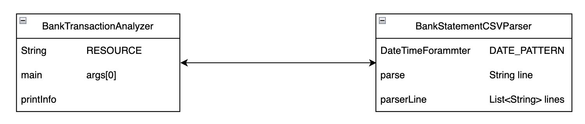
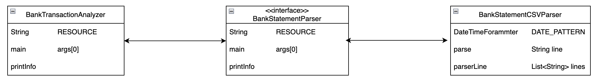

# java-realworld-software
실전 자바 소프트웨어 개발

## 코드 유지보수성을 높이기 위해.
- 특정 기능을 담당하는 코드를 쉽게 찾을 수 있어야 한다.
- 코드가 어떤 일을 수행하는지 쉽게 이해할 수 있어야 한다.
- 새로운 기능을 쉽게 추가한거나 기존 기능을 쉽게 제거할 수 있어야 한다.
- **캡슐화**가 잘 되어 있어야 한다. 코드 사용자에게는 세부 구현 내용을 감추고 사용자가 쉽게 코드를 이해하거나 바꿀 수 있어야 한다.

#### 개발자의 궁극적인 목표는 응용프로그램의 복잡성을 관리하는 것이다. 새로운 요구사항이 생길때마다 쉽게 기능을 추가할 수 있어야 한다. (side effect 최소화)

### 그룹화
일반적으로 다음과 같이 클래스를 그룹화한다.
- 기능
- 정보
- 유틸
- 논리
- 순차
- 시간

## 클래스 수준 응집도.
- 응집도 : 클래스(or) 메서드의 **책임이 얼마나 강하게 연결되어 있는지**의 정도이다.
- 높은 응집도는 개발자의 궁극적 목표이고 쉽게 코드를 찾고, 이해하고, 사용할수 있도록 해야한다.

- 이 코드에서는 [BankStatementCSVParser](https://github.com/ehdtjs0612/java-realworld-software/blob/main/src/main/java/BankStatementCSVParser.java) 클래스를 **그룹화**하여 이 클래스의 응집도가 매우 높다.

현재 프로그램의 **진입점**인 [BankTransactionAnalyzer](https://github.com/ehdtjs0612/java-realworld-software/blob/main/src/main/java/BankTransactionAnalyzer.java)는 파서, 계산, 출력 등 응용프로그램의 다양한 부분을 연결해준다.

**응집도가 떨어지는 클래스의 사례.**
- [cd90f7f](https://github.com/ehdtjs0612/java-realworld-software/commit/cd90f7fb2d856b67e08a9fe81cbcabe1788b395d) 을 보면 계산작업을 하는 로직이 BankTransactionAnalyzer내에 정적으로 선언되어 있다.

#### 파싱이나 결과 전송과는 직접적인 관련이 없음,
-> 고로 [0197bc4](https://github.com/ehdtjs0612/java-realworld-software/commit/0197bc497a236937766e235621747d4a5a1079f1)처럼 별도의 클래스로 분리(그룹화(기능))해주자!

## 메서드 수준 응집도.
- 메서드가 다양한 기능을 수행할수록 메서드가 어떤 동작을 하는지 이해하기가 점점 어려워진다.
- 즉 **메서드가 연관이 없는 여러 일을 처리한다면 응집도가 낮아진다**
- 어떻게 응집도를 높이냐? -> 작은 조각으로 나누어 메서드를 분리하자 (한 메서드에는 한가지 일만(클래스도 동일))

## 결합도.
- 코드를 짤때 가장 중요한 특성으로 결합도(coupling)가 있다. 응집도는 **클래스, 패키지, 메서드** 등의 동작이 얼마나 관련되어 있는가를 가리키는 반면, 결합도는 **한 기능이 다른 클래스에 얼마나 의존하고 있는지를 가늠한다.**
- 어떤 클래스를 구현하는데 얼마나 많은 (다른 클래스)클지식을 참조했는가로 설명할 수 있다.
- 많은 클래스를 참조했다면 그만큼 유연성이 떨어진다
- 만약, 어떤 클래스의 코드를 바꾸면 이 클래스의 의존하는 모든 클래스가 영향을 받는다(의존성, sideEffect)

### 인터페이스 생성 전 UML 다이어그램

### 인터페이스 생성 후 UML 다이어그램

기능을 추상화시켜서 클라이언트가 인터페이스를 바라보게 해서 결합도를 낮춰 유연성을 늘리게 해준다.